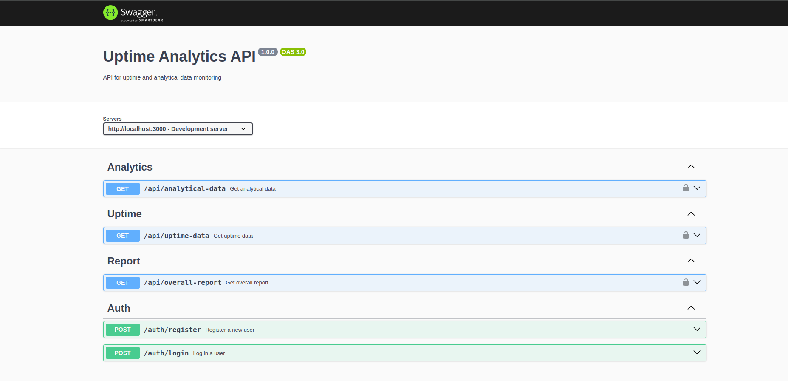

## well documente the API using swaggerUI

- once you cloned and installed nseccery packages add .env varibles properly for mongURI port jwt secret if you use authenticatin feature start running dev server go to endpoint /api-docs
  example:- http://localhost:3000/api-docs/
you see like this :


# Device Monitoring API

This project is a RESTful API server for monitoring device uptime and analytical data. It provides endpoints for retrieving device analytics, uptime information, and overall reports.

## Table of Contents

- [Prerequisites](#prerequisites)
- [Installation](#installation)
- [Database Setup](#database-setup)
- [Running the Server](#running-the-server)
- [API Endpoints](#api-endpoints)
- [Authentication](#authentication)

## Prerequisites

- Node.js (version 18 or higher)
- MongoDB (version 6 or higher)
- Docker (optional, for containerized MongoDB setup) suggested using docker

## Installation

1. Clone this repository:
2. Install dependencies:

## Database Setup

1. Start MongoDB:

- If using Docker:
  ```
  docker run --name mongodb -d -p 27017:27017 mongo
  ```
- If installed locally, start your MongoDB service

2. Load sample data: npm run generate-data

## Running the Server

Start the server with: npm run dev

The server will start on `http://localhost:3000` (or your specified port).

## API Endpoints

**Register**-
**POST** `/api/auth/register` - Body: `{ "username": "your_username", "password": "your_password" }`

- if created succesfully you get resposnse mention successfull

This API uses token-based authentication. To access protected endpoints:

1. Obtain a token:
   - **POST** `/api/auth/login`
     - Body: `{ "username": "your_username", "password": "your_password" }`
   - Response will include an access token

### Analytical Data API these are protected need to give the token to autherization part to get acces the end point

- **GET** `/api/analytics`
  - Returns aggregated analytical data on a per hour per day basis.

### Uptime Data API

- **GET** `/api/uptime`
  - Returns an array of device uptime states with timestamps.

### Overall Report API

- **GET** `/api/report`
  - Returns a comprehensive report including total and average analytical data, busiest and quietest days, and total uptime/downtime.

Note: Tokens are valid for one hour.

## you can test the api working fine(some fixing on going)

- test unit testing: npm test
  implemetnted basic test cases using jest supertest mongodbmemeorysaver

